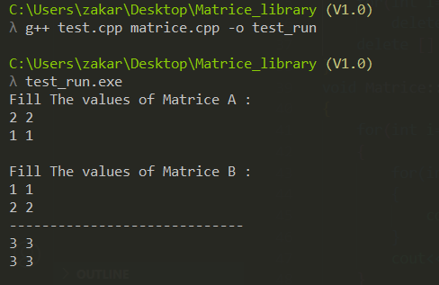

# Matrice Library For C++


[](https://choosealicense.com/licenses/mit/)

[](https://shields.io/)


## Overview

 A C++  Basic Library For interaction with Matrices .

 
This project is a C++ matrix creation and management library that aims to offer necessary matrix operations in an easy-to-use and effective manner. Anyone working with C++ data conversions, linear algebra, or mathematical computations will find it helpful.


[Zakaria Tabati](www.linkedin.com/in/zakariatabati), a C++ enthusiast with a love for software engineering and mathematics, built this library. This project's objective is to create a simple, lightweight matrix library that can be readily incorporated into any C++ project. Feedback and contributions are welcome at [Zakaria Tabati](www.linkedin.com/in/zakariatabati) in order to enhance the library and increase its value for the community.


## Features

- #### Matrix Creation: Create matrices of various sizes with ease.
- #### Basic Operations: Supports common matrix operations such as addition, subtraction, multiplication 
 - #### Various methods for filling out your matrice


## Installation

To use this library, simply clone the repository and incorporate it into your C++ project.

```bash
  git clone https://github.com/your-username/matrice-library.git
```
    
## Run your Program

After Clone the project


Go to the project directory

```bash
  cd my-project
```

Compilation 

```bash
  g++ your_project.cpp matrice.cpp -o your_project
```

Run your Project 

```bash
  your_project.exe
```


## Usage/Examples

```cpp
#include<iostream>

#include "matrice.h"

using namespace std;

int main()
{
    Matrice A(2, 2);  // Create a 2x2 matrix
    Matrice B(2, 2);  // Create another 2x2 matrix

    cout<<"Fill The values of Matrice A : "<<endl;
    A.fill();

    cout<<endl<<"Fill The values of Matrice B : "<<endl;
    B.fill();

    Matrice C = A.ADD(B); // Perform matrix addition
    cout<<"-----------------------------"<<endl;
    C.print(); // Display the result

    return 0;
}


```
The Output  : 





## Contributing

We welcome your contributions! Please feel free to submit pull requests, feature requests, or issues to help the library get better.

See `contributing.md` for ways to get started.


